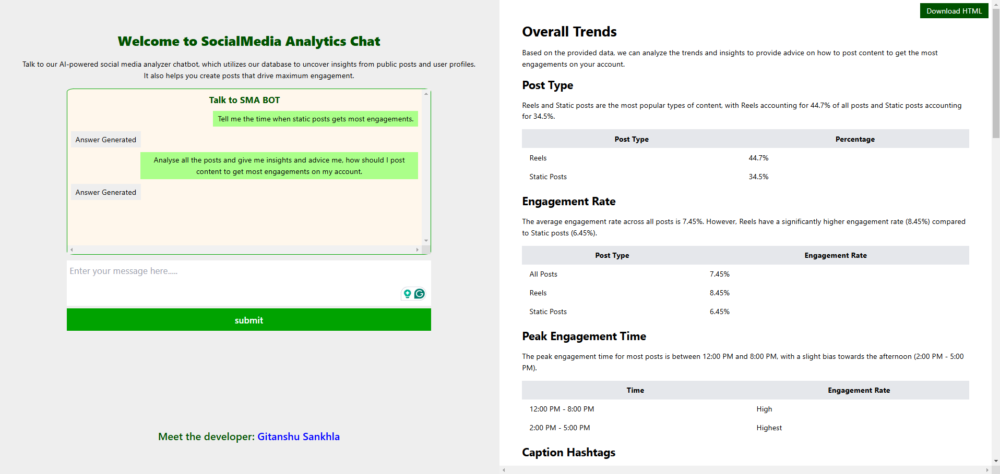
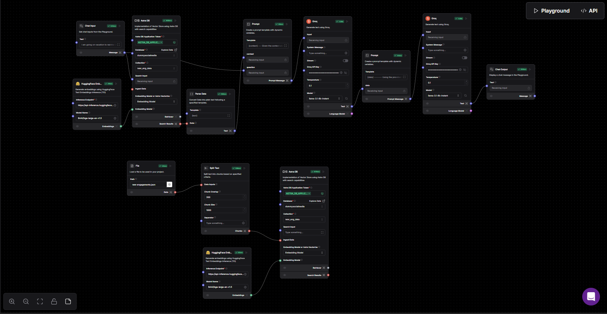

<p align="center">
  <a href="https://skillicons.dev">
    
  </a>
</p>

# Social Media Analysis ChatBot

The **Social Media Analysis ChatBot (SMA Bot)** is an AI-powered chatbot built using Langflow and DataStax Astra DB. It analyzes social media data, providing valuable insights and personalized recommendations. Trained on 500 unique social media posts, SMA Bot helps you optimize your content strategy by suggesting captions, hashtags, the best times to post, and more.

## Table of Contents

- [Social Media Analysis ChatBot](#social-media-analysis-chatbot)
  - [Table of Contents](#table-of-contents)
  - [Key Features](#key-features)
  - [Getting Started](#getting-started)
    - [Prerequisites](#prerequisites)
    - [Setup Instructions](#setup-instructions)
  - [Example Questions](#example-questions)
  - [Technologies Used](#technologies-used)
  - [Application User Interface](#application-user-interface)
  - [Langflow Workflow Diagram](#langflow-workflow-diagram)
  - [Developers](#developers)

## Key Features

- **Data-Driven Insights**: Extracts actionable insights from your social media data, stored in DataStax Astra DB.
- **Personalized Recommendations**: Offers tailored advice on optimal posting times, content types, and strategies for maximizing engagement.

## Getting Started

### Prerequisites

Before running the project, ensure you have the following:

- Node.js installed on your machine
- A Langflow application token

### Setup Instructions

1. **Install Dependencies:**
   Open your terminal and run:
   ```bash
   npm install
   ```
2. **Create an .env File:** Create a file named .env in the root of your project and add your Langflow application token:

   ```javascript
   token=<YOUR_LANGFLOW_APPLICATION_TOKEN>
   ```

3. **Run the Project:** Start the application with:

   ```bash
   npm start
   ```

4. **Access the Application:** Once the server is running, open your browser and visit:
   ```javascript
   http://localhost:{PORT_NUMBER}
   ```
   (Replace {PORT_NUMBER} with the port specified in your .env file.)

## Example Questions

Here are a few example questions you can ask SMA Bot:

- "Give me some insights related to social media engagements and recommend the best time to post for maximum engagement."
- "What is the highest number of likes on a static post?"
- "Compare the performance of static posts, carousels, and reels."
- "Which type of post gets the most comments?"

## Technologies Used

- **Langflow**: Powers the RAG pipeline for natural language processing and generating insights.
- **Groq AI**: LLM (Large Language Model) used within Langflow to analyze data and provide insights.
- **DataStax Astra DB**: A NoSQL database used to store and manage social media post content.
- **Node.js**: Backend server built with Node.js to handle requests.
- **Socket.io**: Facilitates real-time communication between the frontend and backend.
- **JavaScript**: Vanilla JavaScript is used to build the frontend.

## Application User Interface

Below is an example of the output displayed by the chatbot:


## Langflow Workflow Diagram

The Langflow pipeline orchestrates the entire process of data extraction and recommendation generation. Below is the diagram illustrating how Langflow operates:


## Developers

- **Gitanshu Sankhla**

  [](https://github.com/Gitax18) [](https://linkedin.com/in/gitanshu-sankhla)
  [](https://www.instagram.com/gitanshusankhla)
  [](https://www.youtube.com/@gitanshusankhla2261)
